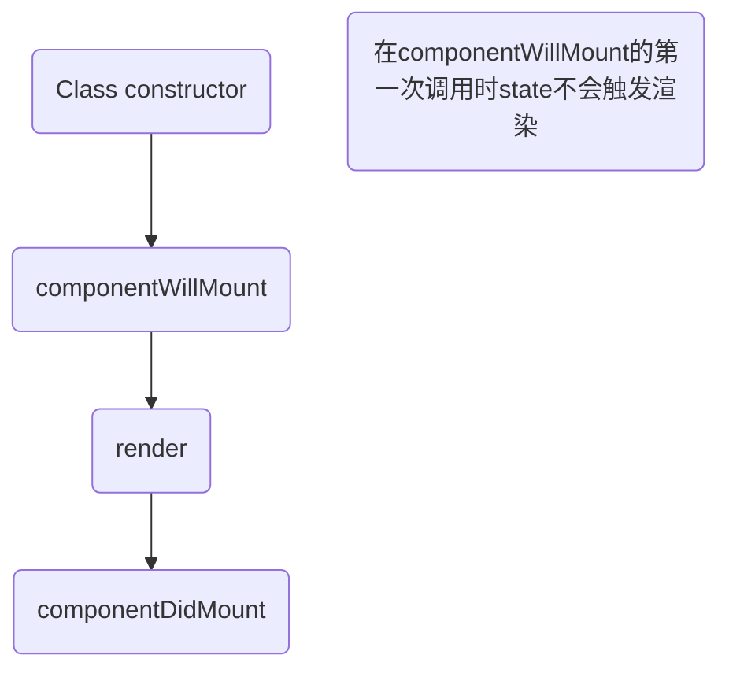

# 					React开发实战

**React入门**

**深入DOM抽象**

**使用组件构建应用程序**

**复杂交互**

**路由**

**Flux**

**性能调优**

**React同构应用**

**测试React组件**

**表单元素**

*受控组件*

- 包含值或已选属性 
- 元素内部的值所渲染的值一直反应属性的值
- 默认情况下用户不能更改

*非受控组件*

- 不用逐个监管用户输入与域
- 用户输入完之后再处理所有内容
- 设置初始值为defaultValue 不是value

*refs*

- 操纵真实的dom
- 通过ref进行标记
- 通过this.refs.标记名 来进行操纵

**使用组件构建应用程序**

- 校验属性

- 组件组合的策略与最佳实践

  + **有状态组件**

  + props是从父组件传递过来的不再改变
  + state是一开始在构造函数中被设置的一个默认值，随着组件的执行不断变换，一个组件在内部管理自己的state
  + **单纯组件**
    + 组件内没有state 只显示数据
  + **数据流和组件通信**
    + 通过props来进行数据流动
  + 组件的生命周期
  + **声明周期的阶段和函数**

+ **不变性**

  **不使用this.state来进行修改state 而是通过this.setStae来进行替换state**

