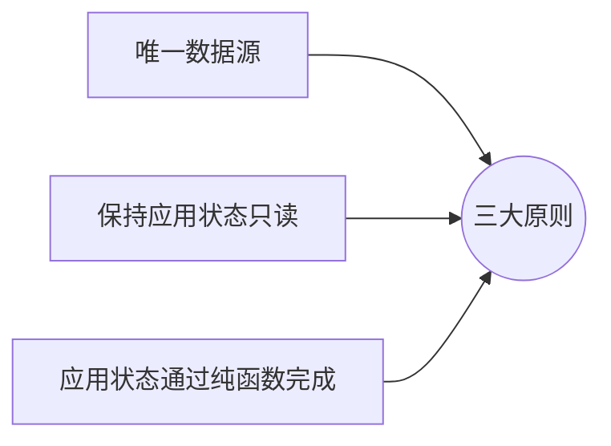
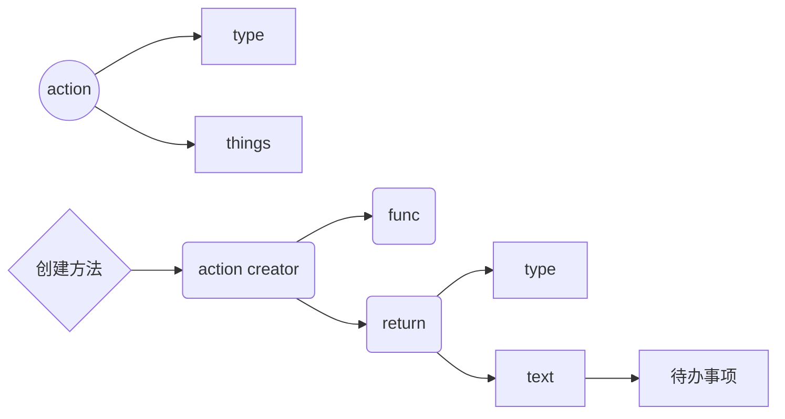
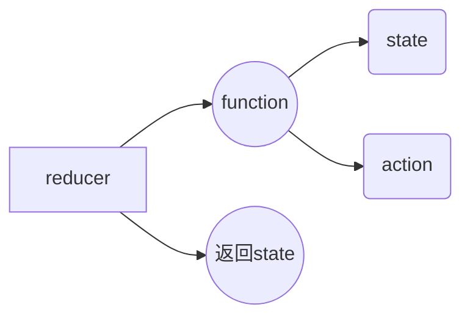
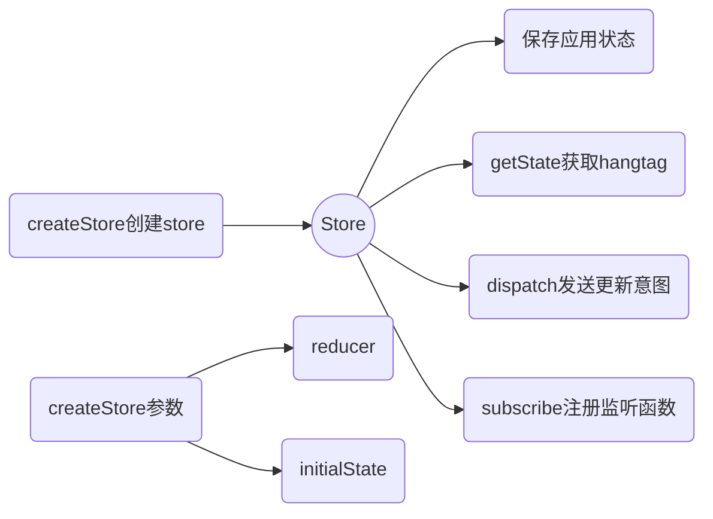

# 					Redux



### 									核心部分

```sequence

participant action
participant store
participant reducer
action -> reducer: type  text
note right of reducer:reducer 处理
store ->reducer:action


```

### 									action 详解

1. _redux中信息的载体_ 
2. _store_唯一的信息来源
3. 是一个普通的js对象
4. action发送给store必须通过store的 dispatch方法 



__action creator 样例：__

```js
function addTodo(text){
    return {
        type:  ' ADD',
        text
    }
}
```

### 											reducer 

## 解析reducer

_根据action 的type作出不同的解析_



state有多个属性，可以拆分多个reducer 来进行解析

### 																						store



