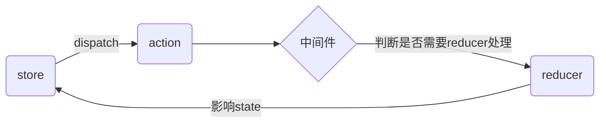

# 			扩展Redux

**中间件**

- [ ] 中间件是独立函数
- [ ] 中间件可以组合使用
- [ ] 中间件有一个统一的接口

**在Redux框架中，中间件时处理action对象**

```mermaid
graph LR
A(store)
B(reducer)
C(action)
D{中间件}
A --dispatch -->C
C -->D
D --判断是否需要reducer处理-->B
B --影响state-->A
```

