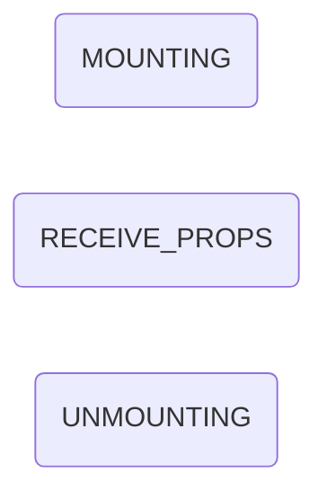
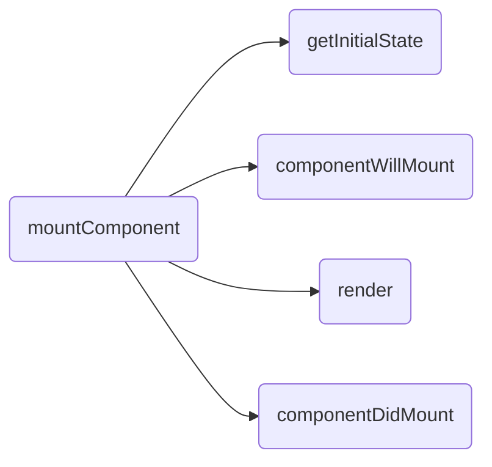
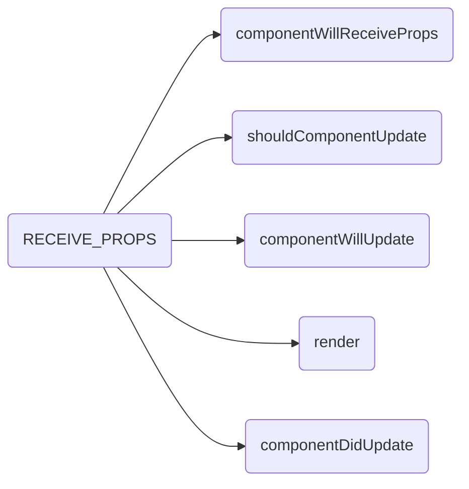
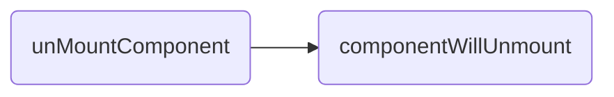
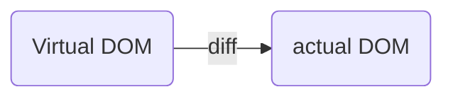

# 			解读React

- [ ] Virtual Dom 模型
- [ ] 生命周期的管理艺术
- [ ] 解密setState机制
- [ ] diff算法
- [ ] React Patch 算法

1. **Virtual DOM**
   - ReactNode
     - ReactElement
       + ReactComponentElement
       + ReactDOMElement
     - ReactFragment
     - ReactText

**生命周期**

1. 首次挂载组件

   *执行顺序如下*

   - getDefaultProps
   - getDefaultState
   - componentWillMount
   - render
   - componentDidMount

2. 卸载组件

   - componentWillUnmount

3. 重新挂组件

   *执行顺序*

   - getInitialState
   - componentWillMount
   - render
   - componentDidMount

4. 再次渲染组件 

   *组件状态受到更新*

   - componentWillReceiveProps
   - shouldComponentUpdate
   - componentWillUpdate
   - render
   - componentDidUpdate

   **MOUNTING阶段中的mountComponent负责下面的的几个**

**RECEIVE_PROPS 负责组件更新的几个**

***在componentWillReceiveProps ，shouldComponentUpdate，componentWillUpdate中并不能获取到最新更新的state不能在这几个func中调用setState会造成循环调用导致浏览器崩溃***

**阶段三UNMOUNTING**

**componentWillUnmount重置所有相关参数**

## setState机制

*setState 实际是调用enqueueSetState方法，在这个方法中，有一个**performUpdateIfNessary** 会获取相应的Element StateQueue 进而调用receiveComponent 或者updateComponent进行组件更新*

**如果在shouldComponentUpdate 或者 componentWillUpdate中调用setState则此时this._pendingStateQueue!=null 更具setState的调用方法此时会调用PerformUpdateIfNessary进行组件更新调用updateComponent ,*在updateComponent中则会调用shoulComponentUpdate和componentWillUpdate* 造成循环调用**

### Diff算法

**diff策略**

- web UI中的DOM节点跨层级移动操作特别少，可以忽略不计
- 拥有相同类的组件将会生成相似的树形结构，拥有不同类的两个组件将会生成不同的树形结构
- 对于用一层级的一组子节点，可以通过唯一的id进行区分

基于策略一 对树进行同一层级的比较两颗树只会对同一层次的节点进行比较

React 通过updateDepth对virtual dom 树进行层级控制

