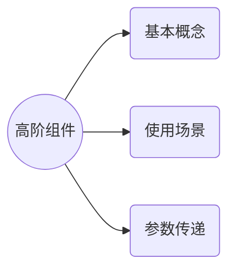
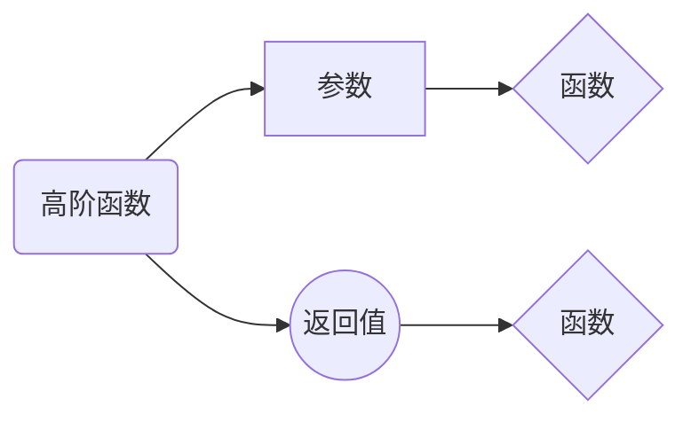
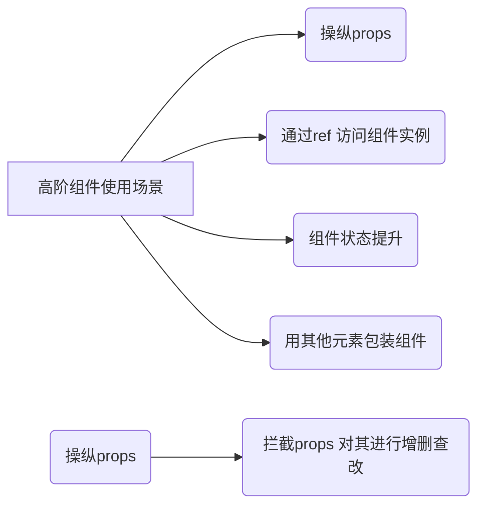

# 高阶组件






# 装饰者模式 
**高阶组件** 

_高阶组件与高阶函数类似_

传入的参数为一个组件例如
``` jsx
function component1(componentItem){
	return class extends Component{
        ComponentWillMount(){
            let data = localStorage.getItem('data);
            this.setState({data});
        }
        render(){
            return <componentItem data = {this.state.data} {...this.props}/>
        }
	}

}
```

将一个组件通过高阶组件进行装饰



_使用高阶组件进行状态提升_ 

__将被包装的组件的状态及相应的状态处理方法提升至高阶组件中，从而使被包装组件无状态__

例如：

``` jsx
function withControlledState(WrappedComponent){
    return class extends Component{
        constructor(props){
            super(props);
            this.state = {
                value:''
            }
        };
        render(){
            const newProps = {
                controlledProps:{
                    value:this.state.value//高阶组件的props 提升到这里了
                }
            }
            return <WrappedComponent {...this.props} {...newProps}/>
        }
    }
}
/*     当我们使用的时候   */
class SimpleControlledComponent extends Component{
    render () {
        return <input name = "simple" {...this.props.controlledProps}/> //这是使用的是高阶组件提升的props 而不是之前的
    }
}
const  ComponentWithControlledeState  = withControlledState(SimpleControlledComponent) //实例化
```

_用其他元素包装组件_ 

```jsx
function withRedBackground(WrappedCompoent){
    return class extends Compoent{
        render(){
            <div style = "backgroudColor:'red'">
            	<WrappedComponent {...this.props}/>
            	</div>
        }
    }
}
```

### 高阶函数的参数并非只能是一个组件 还可以接收其他参数

